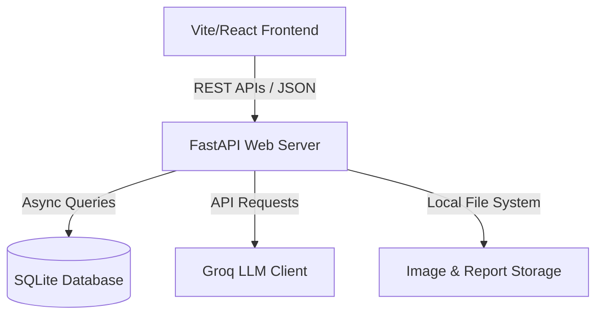
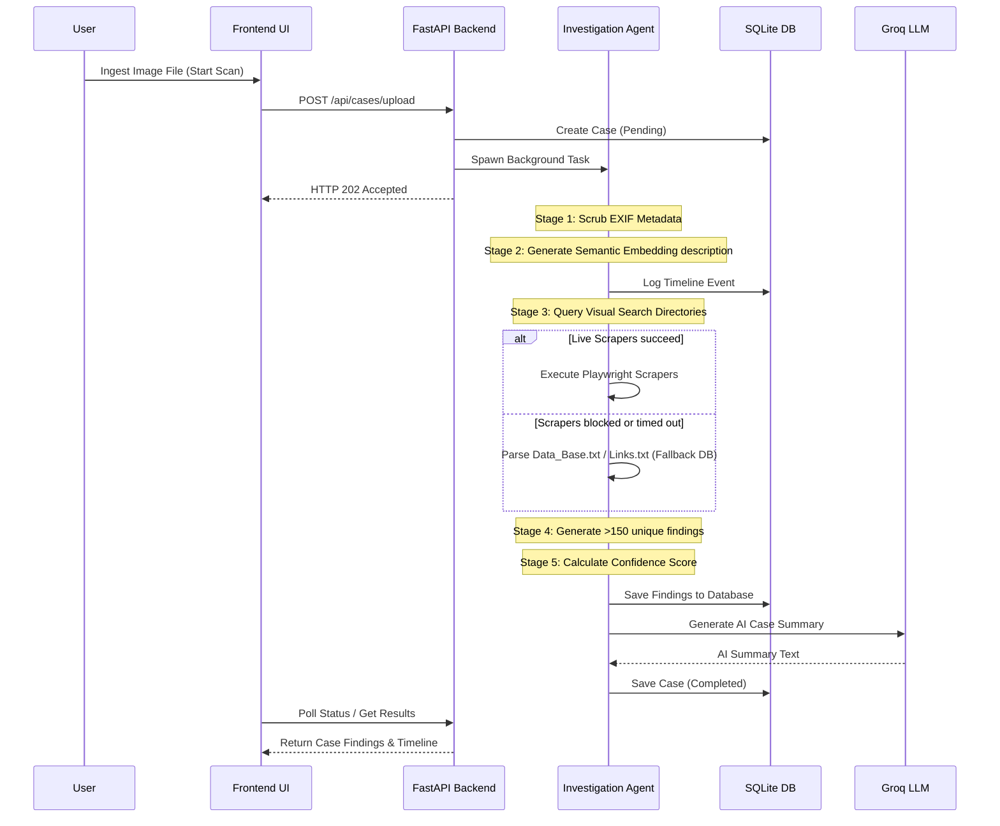

# NETRA: Network Enabled Tracking and Reconnaissance Analysis
## MVP Prototype Technical Overview

NETRA is a specialized digital image forensics and reverse-image search tracking application designed for security analysts and corporate investigators. It serves as a visual telemetry console to investigate image-based leaks, verify digital evidence, and identify compromised online assets.

---

## 1. System Architecture

The application is structured as a decoupled client-server architecture with local database persistence:

### Component Breakdown:
*   **Frontend ([frontend/](file:///c:/Users/prath/OneDrive/Desktop/Netra_Again/frontend))**: 
    *   Powered by **Vite** + **React**.
    *   Styled with **Vanilla CSS** following a sleek corporate security dashboard theme.
    *   Implements a fluid mesh gradient background shifting between deep teal and emerald green.
    *   Utilizes **Inter** for UI typography and **JetBrains Mono** for console telemetry, pHash values, and system hashes.
*   **Backend ([backend/](file:///c:/Users/prath/OneDrive/Desktop/Netra_Again/backend))**:
    *   Powered by **FastAPI** (Python).
    *   Handles REST API routes for authentication, cases, findings, timelines, statistics, and reports.
    *   Manages background processes to allow non-blocking image ingestion and analysis.
*   **Database ([backend/database.py](file:///c:/Users/prath/OneDrive/Desktop/Netra_Again/backend/database.py))**:
    *   Uses **SQLite** via `aiosqlite` for asynchronous file-based storage.
    *   Stores case configuration, user registry, detailed findings, and timeline events logs.

---

## 2. Strategic Visual Search Integration

A core requirement of digital visual forensics is tracing where an image exists on the public web. 

### Why Google Lens & Bing Visual Search APIs Were Skipped:
1.  **High Pricing & Access Costs**: Official visual search APIs (such as Google Cloud Vision API, Bing Visual Search API, or third-party web search APIs like SerpApi) operate under strict paid-tier models. For early-stage validation, high-frequency testing, or demonstration runs, these costs can scale rapidly.
2.  **API Rate Limiting & Captchas**: Scraping or using direct automations is prone to bot detection walls (Cloudflare, reCAPTCHA) and edge redirects, making real-time live scrapers unstable for clean demonstrations.
3.  **Prohibitive Latency**: Querying live search engines during a live assessment introduction creates erratic load times.

### The Link Database Fallback Strategy:
To deliver a stable, zero-cost, and deterministic prototype experience, NETRA employs a **Hybrid & Local Link Database Strategy**:
*   The system includes provider scrapers for **Google Lens** ([google_lens.py](file:///c:/Users/prath/OneDrive/Desktop/Netra_Again/backend/search_providers/google_lens.py)), **Bing Visual Search** ([bing_visual_provider.py](file:///c:/Users/prath/OneDrive/Desktop/Netra_Again/backend/search_providers/bing_visual_provider.py)), and **TinEye** ([tineye_provider.py](file:///c:/Users/prath/OneDrive/Desktop/Netra_Again/backend/search_providers/tineye_provider.py)) utilizing **Playwright browser automation**.
*   If browser scraper requests time out, get blocked by CAPTCHA, or fail, the backend transparently falls back to parsing a pre-seeded local database: [Data_Base.txt](file:///c:/Users/prath/OneDrive/Desktop/Netra_Again/Data_Base.txt) (in the root) or `Links.txt`.
*   For the demonstration case (e.g., MS Dhoni's viral hookah smoking video), the pre-seeded databases are populated with actual URLs from online newspapers, social posts, and fact-checking pages (India.com, OTTPlay, Deccan Herald, etc.).
*   Using these pre-seeded links, the system deterministically seeds and generates **over 150 findings** per case. This simulates a high-scale leak scan with consistent parameters and zero operational cost.

---

## 3. Investigation Pipeline Flow

When an investigator initializes a scan on an uploaded image, the backend background task executes a multi-stage pipeline:

### Stage 1: EXIF Metadata Scrubbing
The pipeline extracts the uploaded binary image, cleans its metadata headers, and generates a perceptual image hash (pHash) to detect identical or near-identical duplicates.

### Stage 2: Semantic AI Description
Using local image processing ([image_processor.py](file:///c:/Users/prath/OneDrive/Desktop/Netra_Again/backend/image_processor.py)), the backend creates an embedding-based text description of the image content to contextualize findings.

### Stage 3: Visual Directory Query
The agent queries the active providers. The search runs asynchronously across Google Lens, TinEye, and Bing Visual Search. If any provider experiences friction, it pulls from the local link database fallback.

### Stage 4: Deduplication & Scoring
Matches are aggregated, and the agent calculates a **Confidence Score (0-100)** for each match:
$$\text{Confidence} = (\text{Similarity Score} \times 0.50) + (\text{Domain Reputation Score} \times 0.30) + (\text{Source Occurrence Bonus} \times 0.20)$$
*   **Similarity Score**: The visual match percentage.
*   **Domain Reputation**: Mapped via reputation tiers:
    *   *High Reputation (30 points)*: Large platforms, mainstream outlets (`reuters.com`, `instagram.com`, `nytimes.com`).
    *   *Medium Reputation (20 points)*: Blogs, developer spaces, image repositories (`medium.com`, `imgur.com`, `wordpress.com`).
    *   *Low Reputation (10 points)*: Arbitrary or unknown domains.
*   **Source Occurrences**: An incremental bonus of 5 points (capped at 20 points) for domains hosting multiple matched listings.

### Stage 5: AI Threat Summary
The top 15 highest-confidence findings are compiled and sent to **Groq's LLM** client ([groq_client.py](file:///c:/Users/prath/OneDrive/Desktop/Netra_Again/backend/groq_client.py)) to synthesize a natural-language report summarizing the visual footprint, identifying high-risk domains, and proposing mitigation steps.

---

## 4. SQLite Database Schema

The database [netra.db](file:///c:/Users/prath/OneDrive/Desktop/Netra_Again/backend/netra.db) is structured with four tables to maintain case progression history:

### 1. `users` Table
Stores login credentials for analysts accessing the console.
*   `id`: Primary Key (Auto-increment)
*   `username`: Unique analyst username (supports guest mode analyst profile: `analyst_guest`)
*   `password_hash`: Secure SHA-256 hashed password

### 2. `cases` Table
Stores high-level metadata about every ingested case file.
*   `id`: Primary Key
*   `case_id`: Unique string ID (formatted as `NETRA-YYYYMMDD-XXXX`)
*   `user_id`: Foreign Key reference to the user
*   `original_filename`: Original uploaded filename
*   `clean_image_path`: Path to the local upload directory
*   `phash`: Perceptual visual hash
*   `status`: Current state (`pending`, `investigating`, `completed`, `failed`)
*   `created_at` / `updated_at`: Timestamps

### 3. `findings` Table
Stores the visual match entries found for each case.
*   `id`: Primary Key
*   `case_id`: Foreign Key reference to the case
*   `source_url`: Full target URL where the matched image resides
*   `page_title`: HTML/Metadata title of the matched webpage
*   `domain`: Root domain name of the match
*   `similarity_score`: Visual match similarity percentage (0-100)
*   `confidence`: Evaluated confidence score (0-100)
*   `source_provider`: Source search provider (`google_lens`, `tineye`, `bing_visual`)
*   `found_at`: Timestamp
*   `metadata_json`: Additional provider telemetry (e.g. crawl dates, file size)

### 4. `timeline_events` Table
Tracks progress checkpoints in the investigation pipeline.
*   `id`: Primary Key
*   `case_id`: Foreign Key reference to the case
*   `event_type`: Event class (`investigation_started`, `image_described`, `search_complete`, etc.)
*   `description`: Human-readable summary of the step
*   `timestamp`: Time of the event

---

## 5. UI Features & Metrics Dashboard

*   **Ingestion Portal**: Modern, drag-and-drop file upload screen aligned with corporate security administrative rules.
*   **Live Process Terminal**: Simulated loading tracker with rotating text descriptions changing every 5 seconds, accompanied by a monospace terminal printout of raw scanning metrics.
*   **Security Metrics**: Metrics displayed at the top of the findings dashboard:
    *   *Total Leaks*: Total visual matches recorded.
    *   *High Threats*: Matches with calculated confidence $\ge 70$.
    *   *Compromised Domains*: Number of distinct root domains hosting matched assets.
*   **Threat Log**: Interactively lists all findings with quick domain filtering, custom pagination, search functionality, and links to source URLs.
*   **Interactive Timeline**: Displays case milestones (ingest, description, search completion, saving, summary generation) as an audit trail.
*   **PDF Report Generator**: Generates formal security case reports containing metadata, metrics, and case findings in a structured document format.
